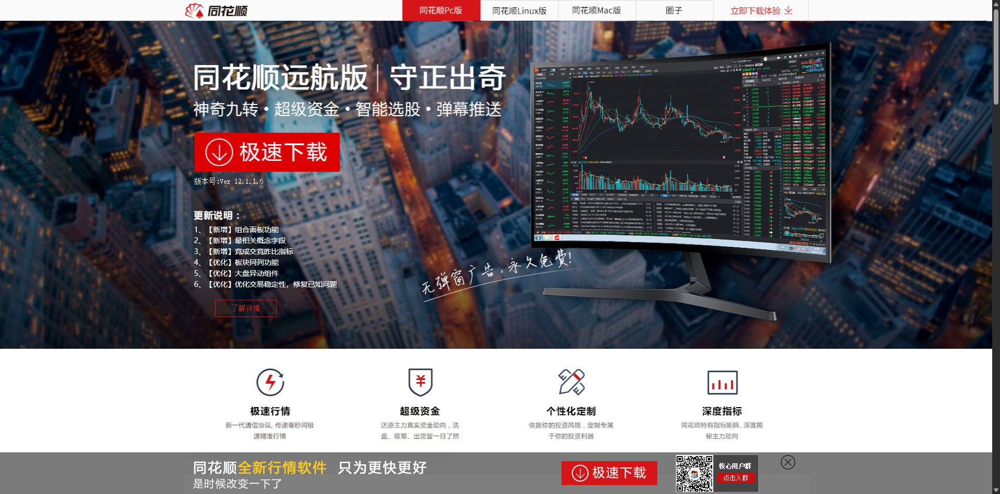
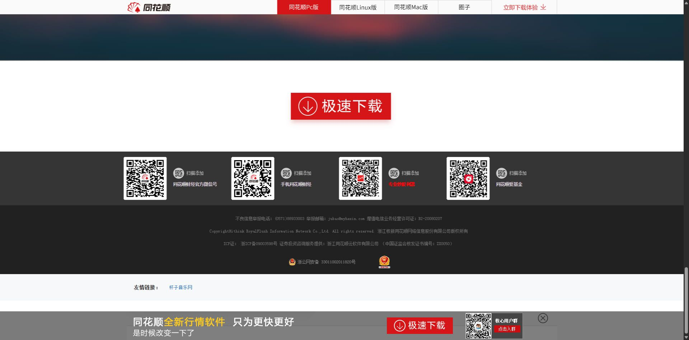

# ToHuaShunDownload | SEO 模仿站

一个基于 **Django** 的「网页克隆 + SEO」示例项目：把目标网页完整克隆成本站页面，并内置全套 SEO 增强与访问日志能力。

> 当前已克隆页面：`同花顺远航版` 宣传落地页（`activity.ths123.com`）。
> 素材与商标归原站所有，本仓库仅用于学习与演示，请勿用于商业用途。

---

## 功能特性

- **整页克隆**
  - HTML 转 Django 模板，CSS / JS / 背景图全部下载到本地 `Web/static/`，不依赖源站资源
  - 页面动态文案（版本号 / 更新日志 / 详情链接）由后端请求源接口注入，规避浏览器跨域
- **SEO 优化（搜索引擎友好，全部服务端输出）**
  - 每个页面只有一个 `<h1>`；`<title>` / keywords / description 均有非空默认值
  - 页面底部**友情链接区**：后端抓取小影 API 渲染进 HTML（非前端请求）
  - **外链替换开关** `FRIEND_LINK_REPLACE`：开启后每次访问把页面中指向外站的 `<a>` 随机替换为友情链接（列表缓存 1 小时）
- **请求守卫后台**（`middlewares/request_guard`）
  - 请求日志 / 蜘蛛识别 / 频控 / 封禁规则管理（内置 layui，离线可用）
- **站点地图与爬虫**：`sitemap.xml` / `robots.txt` 已预留接入点

---

## 页面截图

首页顶部（克隆效果）



首页底部：友情链接区（服务端渲染，搜索引擎可直接看到）



> 截图由 chrome-devtools 实时抓取本机运行页面生成。

---

## 项目结构

```
ToHuaShunDownload/
├── manage.py
├── ToHuaShunDownload/        # Django 配置包(settings/urls/wsgi/asgi)
├── Web/
│   ├── views/request.py      # 首页视图(版本信息注入)、错误页、sitemap
│   ├── friend_links.py       # 小影 API 友情链接加载(缓存/过滤/降级)
│   ├── context_processors.py # 向全站注入 friend_links
│   ├── middleware.py         # 外链替换中间件(FRIEND_LINK_REPLACE 开关)
│   ├── static/xb160809/      # 克隆页本地化 CSS/JS/图片
│   └── templates/            # template.html 母版 + index.html 克隆页 + 错误页
├── middlewares/request_guard # 请求守卫组件(日志/规则/蜘蛛识别)
├── media/favicon.ico         # 已替换为源站 favicon
├── screenshots/              # README 页面截图
├── cache/                    # 文件缓存(运行时生成)
└── .env                      # 环境配置(不入库)
```

---

## 快速开始

```powershell
# 1. 创建并激活虚拟环境
python -m venv .venv
.\.venv\Scripts\Activate.ps1

# 2. 安装依赖
pip install -r requirements.txt

# 3. 建库(请求守卫日志表)
python manage.py migrate

# 4. 启动
python manage.py runserver 0.0.0.0:8000
```

访问 <http://127.0.0.1:8000/> 查看首页。

---

## 环境变量配置（.env）

| 变量 | 说明 |
|---|---|
| `DEBUG` | `False`（生产） / `True`（调试） |
| `ALLOWED_HOSTS` | 允许访问的域名，逗号分隔 |
| `XIAOYING_API_BASE` | 小影 API 基础地址（友情链接数据源） |
| `FRIEND_LINK_REPLACE` | `on`=开启外链替换；`off`=关闭（修改实时生效，无需重启） |
| `XIAOYING_API_APPID / XIAOYING_API_APPSECRET` | 小影 API 凭证（按需） |
| `CACHE_TTL_HOURS` | 内容缓存时长，默认 `2` |

## 请求守卫后台

- 地址前缀、后台密码见 `middlewares/request_guard/config.json`（默认 `/request-guard/`，密码 `123456`，上线请修改）
- 功能：请求日志、蜘蛛/真人/直连身份识别、频控、IP/UA/路径规则（403/伪装/跳转/仅记录）

---

## 版权与联系

- 页面素材版权归原站所有，本仓库仅学习用途。
- 微信：duyanbz
